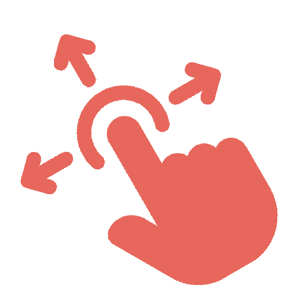

<br>
# Drag N Drop
<i>Event-driven drag & drop: you decide when a drag starts and stops, and the object follows a drag point you update each tick. A drop-in replacement for Construct 3's built-in Drag & Drop, driven through Start Drag / Drop / Set Drag Point actions so a controller, touch gesture, AI routine, or virtual cursor can all drive it. Optional solid push-out, axis lock, break distance, and automatic throw-velocity measurement.</i> <br>
### Version 1.1.0.0

[](https://github.com/SalmanShhh/C3Addon_Drag-N-Drop/releases/download/salmanshh_dragndrop-1.1.0.0.c3addon/salmanshh_dragndrop-1.1.0.0.c3addon)
<br>
<sub> [See all releases](https://github.com/SalmanShhh/C3Addon_Drag-N-Drop/releases) </sub> <br>

#### What's New in 1.1.0.0
- **Added:** - Snapping, Magnetism and Homing.
- **Changed:** - overhaul on the vocabulary for the ACEs.
- **Changed:** - Exposed a few simple properties
- **Changed:** - Reworked axis lock into 8Direction-style Directions

<sub>[View full changelog](#changelog)</sub>

---
<b><u>Author:</u></b> SalmanShh <br>
<sub>Made using [CAW](https://marketplace.visualstudio.com/items?itemName=skymen.caw) </sub><br>

## Table of Contents
- [Usage](#usage)
- [Examples Files](#examples-files)
- [Properties](#properties)
- [Actions](#actions)
- [Conditions](#conditions)
- [Expressions](#expressions)
---
## Usage
To build the addon, run the following commands:

```
npm i
npm run build
```

To run the dev server, run

```
npm i
npm run dev
```

## Examples Files

---
## Properties
| Property Name | Description | Type |
| --- | --- | --- |
| Enabled | Whether the behaviour is active when the layout starts. | check |
| Follow Speed | Max speed in pixels per second the object catches up to the drag point. 0 = instant snap. | float |
| Directions | Constrains drag movement, 8Direction style: free, single-axis, or snapped to 4 / 8 directions. | combo |
| Solid Collision | When on, the dragged object is pushed out of solids and cannot be dragged through them. | check |
| Break Distance | Gap to the drag point that auto-ends the drag. 0 disables it. | float |
| Break Action | What a break-distance end does: Drop applies the throw, Cancel ends silently. | combo |


---
## Actions
| Action | Description | Params
| --- | --- | --- |
| Add snap object | Registers an object as a snap and magnet target by its position. Use a For each loop to add many. Needs a snap radius to take effect. | Object             *(object)* <br> |
| Add snap position | Registers a world-space position as a snap and magnet target. Needs a snap radius to take effect. | X             *(number)* <br>Y             *(number)* <br> |
| Clear snap targets | Removes all registered snap positions and snap objects. |  |
| Drop | Ends the current drag. Release applies the measured throw; Cancel ends silently. Ignored if not dragging. | How             *(combo)* <br> |
| Set break distance | If the gap to the drag point grows past the distance, the drag ends automatically. 0 disables this. | Distance             *(number)* <br>Action             *(combo)* <br> |
| Set directions | Constrains drag movement, 8Direction style: free, a single axis, or snapped to 4 / 8 directions. | Directions             *(combo)* <br> |
| Set drag point | Updates the world-space point the object follows. Call every tick while dragging. | X             *(number)* <br>Y             *(number)* <br> |
| Set enabled | Enables or disables the behaviour. Disabling cancels any in-progress drag. | Enabled             *(boolean)* <br> |
| Set follow speed | How fast the object catches up to the drag point, in pixels per second. 0 = instant snap. | Speed             *(number)* <br> |
| Set magnet strength | How strongly the object is pulled toward an in-range snap target while dragging, from 0 (snap only on drop) to 1 (strong homing). | Strength             *(number)* <br> |
| Set snap radius | Distance in pixels within which the object snaps to a target on drop and is magnetised while dragging. 0 disables snapping. | Radius             *(number)* <br> |
| Set solid collision | When on, the dragged object is pushed out of solids each tick and cannot be dragged through them. | Enabled             *(boolean)* <br> |
| Set throw velocity | Overrides the measured throw before a release. Pass 0, 0 to suppress the throw entirely. | Velocity X             *(number)* <br>Velocity Y             *(number)* <br> |
| Start drag | Begins dragging this object toward a drag point. Ignored if already dragging. | Drag point X             *(number)* <br>Drag point Y             *(number)* <br>Grab mode             *(combo)* <br> |


---
## Conditions
| Condition | Description | Params
| --- | --- | --- |
| Is dragging | True while the object is being dragged. |  |
| Is enabled | True if the behaviour is active. |  |
| Is snapping | True while the dragged object is within snap radius of a target (so a drop would snap to it). |  |
| On drag cancelled | Triggered when a drag ends via Drop (cancel) or a break-distance cancel. No throw is applied. |  |
| On drag started | Triggered when Start Drag succeeds. |  |
| On dropped | Triggered when a drag ends via Drop (release) or a break-distance drop. The throw is available. |  |
| On hit solid | Triggered the first tick the dragged object is pushed out of a solid (solid collision must be on). |  |
| On snapped | Triggered after a release that lands within snap radius of a target. Fires alongside On Dropped. Read SnapTargetX, SnapTargetY, and SnappedObjectUID. |  |


---
## Expressions
| Expression | Description | Return Type | Params
| --- | --- | --- | --- |
| DistanceFromPoint | Current gap in pixels between the object and the drag point. Grows while blocked by a solid. | number |  | 
| DragPointX | Current world-space X of the drag point. | number |  | 
| DragPointY | Current world-space Y of the drag point. | number |  | 
| DropReason | Why the drag ended: "manual" for a Drop action, "broke_distance" for a break-distance end. | string |  | 
| SnappedObjectUID | UID of the object snapped to on the last drop, or -1 if the snap was a position or no snap occurred. | number |  | 
| SnapTargetX | X of the nearest snap target. While dragging it tracks the nearest target; after a snap it is the snapped position. | number |  | 
| SnapTargetY | Y of the nearest snap target. While dragging it tracks the nearest target; after a snap it is the snapped position. | number |  | 
| ThrowSpeed | Magnitude of the throw velocity. Use inside On Dropped. | number |  | 
| ThrowVelocityX | X component of the measured throw velocity. Use inside On Dropped. | number |  | 
| ThrowVelocityY | Y component of the measured throw velocity. Use inside On Dropped. | number |  | 


---
## Changelog

**1.1.0.0**
- **Added:** - Snapping, Magnetism and Homing.
- **Changed:** - overhaul on the vocabulary for the ACEs.
- **Changed:** - Exposed a few simple properties
- **Changed:** - Reworked axis lock into 8Direction-style Directions

**1.0.0.0**

**0.0.0.0**
- **Added:** Initial release.
